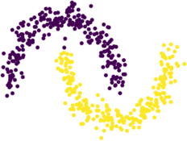
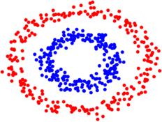
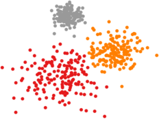

# Graph-based Clustering and Semi-Supervised Learning

&nbsp;&nbsp;&nbsp;&nbsp;&nbsp;&nbsp;&nbsp;&nbsp;
&nbsp;&nbsp;&nbsp;&nbsp;&nbsp;&nbsp;&nbsp;&nbsp;
&nbsp;&nbsp;&nbsp;&nbsp;&nbsp;&nbsp;&nbsp;&nbsp;


This python package is devoted to efficient implementations of modern graph-based learning algorithms for both semi-supervised learning and clustering. The package implements many popular datasets (currently MNIST, FashionMNIST, cifar-10, and WEBKB) in a way that makes it simple for users to test out new algorithms and rapidly compare against existing methods.

Download the package locally with 

```
git clone https://github.com/jwcalder/GraphLearning
```

The main python file is graphlearning.py. The demo scripts semi-supervised_demo.py and clustering_demo.py give basic examples of how to use the package on synthetic data. The clustering script reproduces the figures above, which are the result of spectral clustering on toy examples. The file main.py implements a user-friendly interface to run experiments comparing different datasets and algorithms over randomization of labeled and unlabeled data.

This package also reproduces experiments from our paper

Calder, Cook, Thorpe, Slepcev. [Poisson Learning: Graph Based Semi-Supervised Learning at Very Low Label Rates.](https://arxiv.org/abs/2006.11184)) To appear in International Conference on Machine Learning (ICML) 2020. 

## Python requirements and C code extensions

To install required non-standard packages:

```
pip install -r requirements.txt
```

Some parts of the package rely on C code acceleration that needs to be compiled. To compile the C code run

```
python cmodules/cgraphpy_setup.py build_ext --inplace
```

## Getting started with basic experiments

A basic experiment comparing Laplace learning/Label propagation to Poisson learning on MNIST can be run with the commands below.

```
python main.py -d MNIST -m vae -a Laplace -t 10
python main.py -d MNIST -m vae -a Poisson -t 10
```

The flag -d specifies the dataset (MNIST, FashionMNIST, WEBKB, or cifar), -m specifies the metric for constructing the graph (vae is the variational autoencoder weights as described in our paper; other options are L2 and scatter), -a is the choice of semi-supervised learning or clustering algorithm, and -t is the number of trials to run. All scripts have a help flag -h that shows a detailed list of options. For example, run

```
python main.py -h
```

to see the list of all options for the main graph-based learning script. The package also has implementations of some graph-based clustering algorithms. For example, run 

```
python main.py -d MNIST -m vae -a SpectralNgJordanWeiss -x 4
python main.py -d MNIST -m vae -a INCRES
```

to perform spectral clustering and INCRES clustering method on MNIST. The package will detect whether to perform clustering or semi-supervised learning based on the choice of algorithm provided with the -a flag.

### List of currently supported algorithms

Below is a list of currently supported algorithms with links to the corresponding papers.

**Semi-supervised learning:** [Laplace](https://www.aaai.org/Papers/ICML/2003/ICML03-118.pdf), [RandomWalk](https://link.springer.com/chapter/10.1007/978-3-540-28649-3_29), [Poisson](https://arxiv.org/abs/2006.11184), [PoissonMBO](https://arxiv.org/abs/2006.11184), [pLaplace](https://arxiv.org/abs/1901.05031), [WNLL](https://link.springer.com/article/10.1007/s10915-017-0421-z), [ProperlyWeighted](https://arxiv.org/abs/1810.04351), NearestNeighbor, [MBO](https://ieeexplore.ieee.org/abstract/document/6714564), [VolumeMBO](https://link.springer.com/chapter/10.1007/978-3-319-58771-4_27), [DynamicLabelPropagation](https://www.sciencedirect.com/science/article/abs/pii/S0031320315003738), [SparseLabelPropagation](https://arxiv.org/abs/1612.01414), [CenteredKernel](https://romaincouillet.hebfree.org/docs/conf/SSL_ICML18.pdf)


**Clustering:** [INCRES](https://link.springer.com/chapter/10.1007/978-3-319-91274-5_9), [Spectral](https://link.springer.com/article/10.1007/s11222-007-9033-z), [SpectralShiMalik](https://ieeexplore.ieee.org/abstract/document/868688), [SpectralNgJordanWeiss](http://papers.nips.cc/paper/2092-on-spectral-clustering-analysis-and-an-algorithm.pdf)

The algorithm names are case-insensitive in all scripts. NearestNeighbor chooses the label of the closest labeled node in the geodesic graph distance.


## Label Permutations

The randomization of labeled vs unlabeled data is controlled by label permutation files stored in the subdirectory LabelPermutations/, to ensure the randomization is the same among all algorithms being compared. A randomized label permutation file can be generated with the script CreateLabelPermutation.py as below:

```
python CreateLabelPermutation.py -d MNIST -m 1,2,3,4,5 -t 100
```

The flag -m controls the label rate; the command above uses 1,2,3,4, and 5, labels per class. The flag -t controls how many trials. So the command above will produce 500 separate experiments, 100 at 1 label per class, 100 at 2 labels per class, etc. There is also a flag -n to give the label permutation a different name from the default one. The label permutations provided in github were constructed as above.

## Nearest neighbor data

All datasets have been preprocessed with a feature transformation followed by a k-nearest neighbor search. The k-nearest neighbor information is stored in the subdirectory kNNData/, and this data is loaded by main.py to construct a weight matrix for the graph. This allows the user flexibility in the construction of the graph, and removes the need to constantly recompute the k-nearest neighbors, which is computationally expensive.

In particular, the raw data from which the kNN data is computed is not provided in github, due to file size restrictions. If needed, the user can download the raw data

```
python download_data.py
```

Then the script ComputeKNN.py can be used to perform the preprocessing steps of applying a feature transformation followed by a k-nearest neighbor search. To run this on MNIST with the scattering transform as the feature transformation, run 

```
python ComputeKNN.py -d MNIST -m scatter
```

The deep learning-based feature transformations (e.g., variational autoencoder (vae) or autoencoding transformations (aet) weights) are not provided as built-in subroutines. Normally it will only be necessary to run ComputeKNN.py when adding a new dataset or trying a new feature transformation on an existing dataset.


## Plotting and LaTeX table creation

The accuracy results for each trial are saved to .csv files in the subdirectory Results/. The package has built-in functions to easily create plots and LaTeX tables of accuracy scores. To run experiments comparing Laplace and Poisson learning and generate accuracy plots and tables, run

```
python main.py -d MNIST -m vae -a Laplace -t 10
python main.py -d MNIST -m vae -a Poisson -t 10
python plot.py
python table.py
```

### Contact and questions


Email <jwcalder@umn.edu> with any questions or comments.


